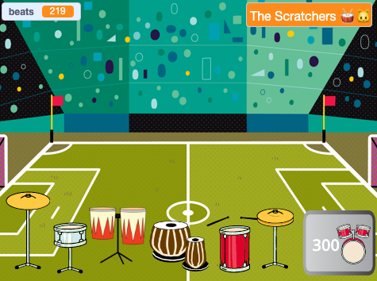

## Challenge

<div style="display: flex; flex-wrap: wrap">
<div style="flex-basis: 200px; flex-grow: 1; margin-right: 15px;">
మీరు మరిన్ని అద్భుతమైన వేదికలపై ప్లే చేస్తున్నప్పుడు మరిన్ని డ్రమ్స్ మరియు మరిన్ని బ్యాక్‌డ్రాప్‌లతో మీ ప్రాజెక్ట్‌ను అప్‌గ్రేడ్ చేయండి. 
</div>
<div>
{:width="300px"}
</div>
</div>

### Add more drums

To add another drum to unlock, look back at the earlier steps of the project.

Here are some reminders if you need them.

--- collapse ---

---
title: For the drum
---

--- task ---

**drum** sprite ని నకలు చేసి, రెండు costume లను జోడించండి.

--- /task ---

--- task ---

`when this sprite clicked`{:class="block3events"} స్క్రిప్ట్ లో ఉపయోగించిన `costume`{:class="block3looks"} మరియు `sound`{:class="block3sound"} ని మార్చండి.

--- /task ---

--- task ---

`when this sprite clicked`{:class="block3events"} స్క్రిప్ట్ లో సాధించిన `beats`{:class="block3variables"} సంఖ్యని మార్చండి.

--- /task ---

--- task ---

**new drum** సందేశానికి బదులుగా, డ్రమ్‌ని `show`{:class="block3looks"} చేసే `message`{:class="block3events"} ని మార్చండి.

--- /task ---

--- /కొలాప్స్ ---

--- collapse ---

---
title: For the 'Get' button
---

--- task ---

**Get** sprite ను నకలు చేయండి.

--- /task ---

--- task ---

** మునుపటి డ్రమ్** యొక్క`broadcast`{:class="block3events"} `message`{:class="block3events"} కి అనుగుణంగా బటన్ ను కనిపింపజేసే `message`{:class="block3events"} ను మార్పు చేయండి.

--- /task ---

--- task ---

కొత్త డ్రమ్ వెలతో సహా `costume`{:class="block3looks"}ని మార్చండి.

--- /task ---

--- task ---

Change the number of `beats`{:class="block3variables"} you must have to unlock this drum in the `if`{:class="block3events"} condition. Change the negative number of `beats`{:class="block3variables"} you `change by`{:class="block3variables"} when you unlock this drum. Change the number that `beats`{:class="block3variables"} needs to be subtracted from in the `join`{:class="block3operators"} block. Change the message that is `broadcast`{:class="block3events"} to the name of the **new drum**.

--- /task ---

--- /కొలాప్స్ ---

--- collapse ---

---
title: For the venue
---

--- task ---

కొత్త బ్యాక్‌డ్రాప్‌ని జోడించండి.

--- /task ---

--- task ---

Add a script to the Stage to `switch backdrop to`{:class="block3looks"} the new backdrop when the `message`{:class="block3events"} for this drum is received.

--- /task ---

మీ డ్రమ్స్ వేరే బ్యాక్‌డ్రాప్‌లో కొత్త స్థానంలో ఉండాలని మీరు కనుగొనవచ్చు.

--- task ---

Add a script starting with `when backdrop changes to`{:class="block3events"} to each **drum** sprite with a `go to`{:class="block3motion"} block to make them change position.

మీరు `when flag clicked `{:class="block3events"} క్లిక్ చేసినప్పుడు వాటి ప్రారంభ స్థానాన్ని కూడా సెట్ చేయాలి.

--- /task ---

--- /కొలాప్స్ ---

### Improve feedback to the player

Tell the player exactly **how many more** beats are needed to unlock the next drum.

--- task ---

Add this code to `join`{:class="block3operators"} the number of beats needed with the text you have used to tell the player they need more beats if they do not have enough to unlock the next drum:

```blocks3
when this sprite clicked
if <(beats)>  [9]> then //if 10 or more beats
hide
change [beats v] by [-10] //take away the cost of upgrade
else
+ say (join ((10) - (beats)) [beats needed!]) for [2] seconds
end
```

**Note**: Update the numbers to match those needed to unlock each drum.

--- /task ---

### Tidy your code

--- task ---

**Tidy:** If you have time, then it's a good idea to make sure the sprites in the sprite list are in a sensible order, starting with the drums in their locked order and then the buttons in order.

--- /task ---

--- task ---

### Stuck?

**డీబగ్:** ముందుగా డ్రమ్‌లు మరియు బటన్‌లు ఎప్పుడు చూపాలి మరియు `beats`{:class="block3variables"} వేరియబుల్ ఎలా మారాలి అని మీరు నిజంగా అర్థం చేసుకున్నారని నిర్ధారించుకోండి. ప్రాజెక్ట్ ఏమి చేయాలో మీకు స్పష్టంగా ఉంటే దాన్ని డీబగ్ చేయడం చాలా సులభం.

--- collapse ---
---
title: నా డ్రమ్ సరిగ్గా చూపడం/దాగడం లేదు
---

అది మొదటి డ్రమ్ అయితే తప్ప, `when flag clicked` {:class = "block3events"} `hide`{: class = "block3looks"} చేయడానికి మీ డ్రమ్ ఒక స్క్రిప్ట్ ను కలిగి ఉండాలి.

It should have a `when I receive`{:class="block3events"} `this drum` script to `show`{:class="block3looks"}.

ఈ డ్రమ్ కోసం **Get** బటన్ అదే సందేశాన్ని `broadcast`{:class="block3events"} చేసేలా తనిఖీ చేయండి.

--- /కొలాప్స్ ---

--- collapse ---
---
title: నా డ్రమ్ సరిగ్గా చూపడం/దాగడం లేదు
---

బటన్ మొదటి డ్రమ్ కోసం తప్ప,`when flag clicked`{:class="block3events"} అది `hide`{:class="block3looks"} చేయాలి.

It should `show`{:class="block3looks"} `when I receive`{:class="block3events"} the message for the **previous drum**.

The **Get** button should `show`{:class="block3looks"} to let the player know about the next drum they can unlock.

--- /కొలాప్స్ ---

--- collapse ---
---
title: I can unlock a drum when I don't have enough beats
---

డ్రమ్ యొక్క**Get** బటన్ కోసం స్క్రిప్ట్ లో `when this sprite clicked`{:class="block3events"} కోసం అవసరమయిన `beats`{:class="block3variables"} సంఖ్యని మీరు మార్పు చేసేలా తనిఖీ చేసుకోండి.

--- /collapse ---

--- collapse ---
---
title: The number of beats doesn't change correctly when I unlock a new drum
---

డ్రమ్ యొక్క**Get** బటన్ కోసం స్క్రిప్ట్ లో `when this sprite clicked`{:class="block3events"} కోసం `changed beats by`{:class="block3variables"} నెగటివ్ సంఖ్య అయ్యేలా మీరు తనిఖీ చేసుకోండి.

ఇది డ్రమ్ బటన్ cistume లోని నంబర్‌తో సరిపోలుతుందని నిర్ధారించుకోండి.

--- /collapse ---

--- /task ---

**చిట్కా:** మీరు నిజంగా గందరగోళానికి గురైతే, కొత్త డ్రమ్ మరియు దాని బటన్‌ను తొలగించి, మళ్లీ ప్రారంభించడం మంచిది. కొన్నిసార్లు బగ్‌ని గుర్తించడం కష్టం.

--- save ---
