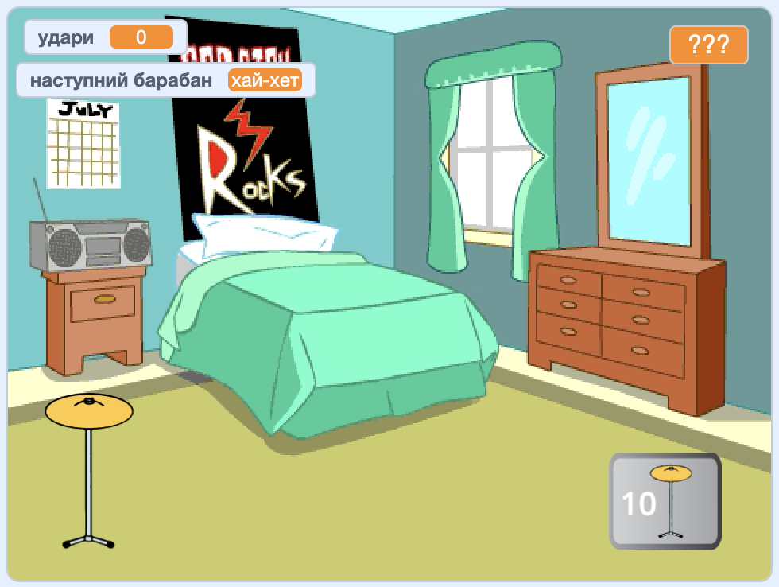

## Що ти зробиш

Створи гру-клікер, де ти робиш більше ударів, щоб грати на нових барабанах і на більших майданчиках.

--- no-print ---

  
Натисни на барабан і дивись, як збільшується кількість `ударів`{:class="block3variables"}. Отримай новий барабан, коли ти назбираєш достатньо ударів. 

Скільки `ударів`{:class="block3variables"} ти заробляєте, клацаючи по новому барабану?

  <iframe allowtransparency="true" width="485" height="402" src="https://scratch.mit.edu/projects/embed/522323676/?autostart=false" frameborder="0"></iframe>

--- /no-print ---

--- print-only ---

--- /print-only ---
