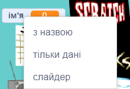

## Налаштуй сцену

<div style="display: flex; flex-wrap: wrap">
<div style="flex-basis: 200px; flex-grow: 1; margin-right: 15px;">
На цьому кроці ти підготуєш основу для свого першого виступу та вибереш собі рок-зіркове імʼя.
</div>
<div>
{:width="300px"}
</div>
</div>

--- task ---

Відкрий проєкт [Барабана зірка — початковий проєкт](https://scratch.mit.edu/projects/535783147/editor){:target="_blank"}. Скретч відкриється у новій вкладці браузера.

--- /task ---

Рок-зірка починає грати вдома, як новачок!

--- task ---

Натисни **Виберіть тло** і пошукай за ключовим словом `bedroom` (спальня).

Вибери спальню та додай її до свого проєкту. Ми обрали `Bedroom 3`.


--- /task ---

У Скретчі ти можеш додати код до сцени.

--- task ---

Натисни на тло своєї спальні на панелі сцени та додай цей код:


```blocks3
when flag clicked
switch backdrop to (Bedroom 3 v) // назва твого тла
```

--- /task ---

Кожен музикант повинен вибрати собі рок-зіркове ім'я.

**Змінна** — це спосіб зберігання чисел або тексту. Твоє рок-зіркове ім'я буде зберігатися в `змінній`{:class="block3variables"}, тому його можна буде використовувати будь-коли.

--- task ---

У меню блоків `Змінні`{:class="block3variables"} натисни кнопку **Створити змінну**.

Назви нову змінну `ім’я`:


**Примітка:** нова змінна `ім’я` з’явилася на сцені, і тепер її можна використовувати в блоках `змінних`{:class="block3variables"}.

--- /task ---

--- task ---

На початку проєкту твоє рок-зіркове ім'я невідоме.

Додай блок `надати «ім'я» значення`{:class="block3variables"} `???`:


```blocks3
when flag clicked
switch backdrop to (Bedroom 3 v) // назва твого тла
+ set [імʼя v] to [???] // твоя змінна
```

--- /task ---

Ти можеш `запитати`{:class="block3sensing"} щось у Скретчі, а потім використати `змінну`{:class="block3variables"} для зберігання `відповіді`{:class="block3sensing"}.

--- task ---

Натисни меню блоків `Датчики`{:class="block3sensing"} і додай до свого коду блок `запитати`{:class="block3sensing"}:

```blocks3
when flag clicked
switch backdrop to (Bedroom 3 v) // назва твого тла
set [імʼя v] to [???] // твоя змінна
+ ask [Яке твоє рок-зіркове імʼя?] and wait // твоє питання
```

--- /task ---

--- task ---

Надай `змінній`{:class="block3variables"} `ім'я`{:class="block3variables"} значення `відповідь`{:class="block3sensing"}:

```blocks3
when flag clicked
switch backdrop to (Bedroom 3 v) // назва твого тла
set [імʼя v] to [???] // твоя змінна
ask [Яке твоє рок-зіркове імʼя?] and wait // твоє питання
+ set [імʼя v] to (answer)
```

--- /task ---

--- task ---

Клацни правою кнопкою миші по `змінній`{:class="block3variables"}, яка знаходиться на Сцені, та вибери **тільки дані**:



--- /task ---

--- task ---

Перетягни `змінну`{:class="block3variables"} у верхній правий кут сцени:


--- /task ---

--- task ---

**Протестуй:** запусти свій проєкт і перевір, чи `змінна`{:class="block3variables"} спочатку має значення `???`, а потім приймає значення твоєї `відповіді`{:class="block3sensing"}.

--- /task ---

Тобі необовʼязково вводити відповідь щоразу, як ти тестуєш свій проєкт.

--- task ---

Перетягни два останні блоки коду в бік від решти скрипту.

```blocks3
when flag clicked
switch backdrop to (Bedroom 3 v) // назва твого тла
set [імʼя v] to [???] // твоя змінна
```

```blocks3
ask [Яке твоє рок-зіркове імʼя?] and wait // твоє питання
set [імʼя v] to (answer)
```

--- /task ---

--- save ---
