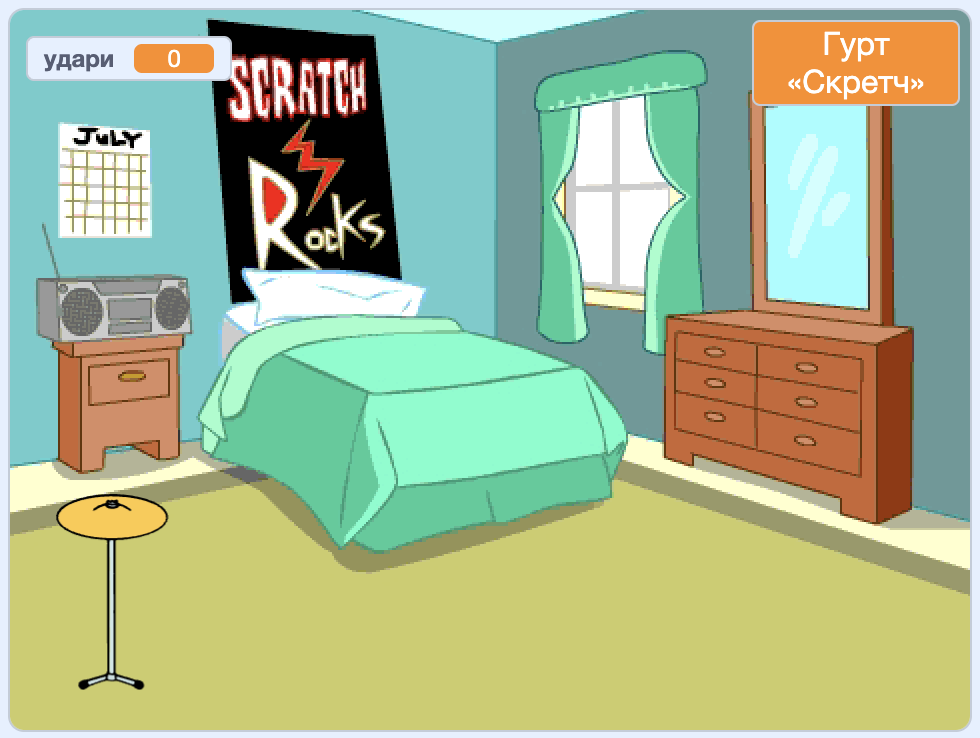
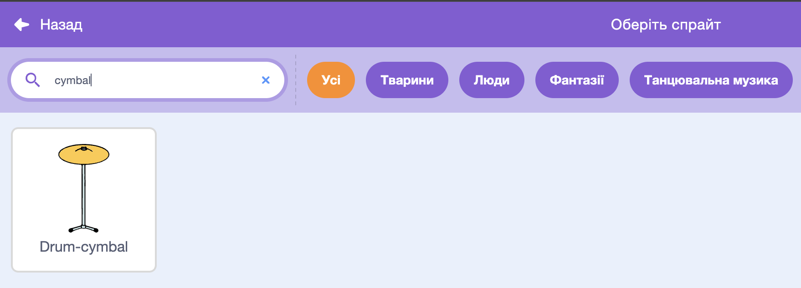
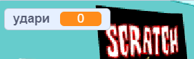

## Барабан початківця

<div style="display: flex; flex-wrap: wrap">
<div style="flex-basis: 200px; flex-grow: 1; margin-right: 15px;">
Ти додаси спрайт **тарілки**, на який можна натискати, щоб заробляти удари та відтворювати звук.
</div>
<div>
{:width="300px"}
</div>
</div>

--- task ---

Натисни **Обрати спрайт** і введи у поле пошуку `cymbal` («тарілки» англійською).



--- /task ---

--- task ---

Додай спрайт **Drum-cymbal** і розмісти його на сцені:


--- /task ---

--- task ---

Додай розширення **Музика**:

[[[generic-scratch3-add-music-extension]]]

--- /task ---

--- task ---

Додай скрипт, щоб тарілка `змінювала образ`{:class="block3looks"} і `програла на барабані`{:class="block3extensions"}:


```blocks3
when this sprite clicked
switch costume to [drum-cymbal-b v] // образ під час удару
play drum [(5) Open High-Hat v] for [0.25] beats // звук барабана
switch costume to [drum-cymbal-a v]  // образ без удару
```

--- /task ---

--- task ---

**Протестуй:** натисни на тарілку, щоб перевірити її.

Переконайся, що чуєш звук і бачиш зміну образа.

--- /task ---

Спрайт **Drum-cymbal** зароблятиме тобі один удар щоразу, коли ти на нього натискатимеш.

--- task ---

Створи `змінну`{:class="block3variables"} (для всіх спрайтів) під назвою `удари`:



--- /task ---

--- task ---

Додай блок `змінити «удари» на 1`{:class="block3variables"}, коли ти натискаєш спрайт **Drum-cymbal**:

```blocks3
when this sprite clicked
+change [удари v] by [1]
switch costume to [drum-cymbal-b v]
play drum [(5) Open High-Hat v] for [0.25] beats 
switch costume to [drum-cymbal-a v]
```

--- /task ---

--- task ---

**Протестуй:** натисни на спрайт **Drum-cymbal** і перевір, як він працює.

Ти маєш побачити, як збільшується значення змінної `удари`{:class="block3variables"}.

--- /task ---

Змінна `удари`{:class="block3variables"} має починатися з `0` ударів, коли ти починаєш нову гру.

--- task ---

Натисни на панель сцени, а потім на вкладку **Код**.

Додай блок `надати «удари» значення`{:class="block3variables"} `0`:


```blocks3
when flag clicked
switch backdrop to (Bedroom 3 v) 
set [імʼя v] to [???] 
+ set [удари v] to [0]
```
--- /task ---

--- task ---

**Протестуй:** натисніть зелений прапорець і переконайся, що твоя змінна `удари`{:class="block3variables"} починається з `0`.

--- /task ---

--- save ---
