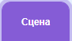

## Наступний барабан

--- task ---

Додай спрайт **Drum-snare** до свого проєкту та розмісти його на сцені:


--- /task ---

--- task ---

Перетягни скрипт `коли спрайт натиснуто`{:class="block3events"} зі спрайта **Drum-cymbal** до спрайта **Drum-snare**.

--- /task ---

--- task ---

Зміни образ і звук у спрайті **Drum-snare**.


```blocks3
when this sprite clicked
+switch costume to [drum-snare-b v] // образ під час удару
+play drum [(1) Snare Drum v] for [0.25] beats // звук барабана
+switch costume to [drum-snare-a v] // образ без удару
```

--- /task ---

--- task ---

Зміни кількість зароблених ударів на `2`:

```blocks3
when this sprite clicked
+change [beats v] by [2] // 2 удари за клік
switch costume to [drum-snare-b v] // образ під час удару
play drum [(1) Snare Drum v] for [0.25] beats // звук барабана
switch costume to [drum-snare-a v] // образ без удару
```

--- /task ---

--- task ---

**Протестуй:** випробуй свій проєкт.

Ти маєш заробляти 2 удари щоразу, як натискаєш на малий барабан.

--- /task ---

Наступний барабан не буде доступним на початку проєкту. Його треба заробити за допомогою ударів.

--- task ---

Додай скрипт до спрайта **Drum-snare**, щоб приховати його на початку проєкту:

```blocks3
when flag clicked
hide
```

--- /task ---

Додай кнопку, щоб показати, який барабан наступний і скільки ударів він буде коштувати.

--- task ---

**Продублюй** спрайт **Отримати**:


--- /task ---

--- task ---

Зміни видимість на **Показати**. 

--- /task ---

--- task ---

Зміни його назву на `Отримати малий барабан`.

--- /task ---

--- task ---

Розташуй його в нижньому правому куті сцени:


--- /task ---

--- task ---

Натисни на спрайт **Drum-snare** і перейди на вкладку **Образи**.


Використовуй інструмент **Обрати** (Стрілочка), щоб вибрати частину образу «без удару». Натисни іконку **Групувати**, а потім іконку **Копія**:


--- /task ---

--- task ---

Натисни спрайт **Отримати малий барабан** і **Встав** образ малого барабана. Можливо, тобі знадобиться змінити його розмір і розташувати так, щоб він вмістився на кнопці:


--- /task ---

--- task ---

Натисни вкладку **Код** і додай скрипт, щоб спрайт **Отримати малий барабан** було видно на початку проєкту:


```blocks3
when flag clicked
show
```

--- /task ---

Наступний барабан можна купити, лише якщо користувач має `10` або більше ударів.

--- task ---

Додай цей код, щоб відкрити наступний барабан, `якщо`{:class="block3control"} у гравця достатньо ударів, або `скажи`{:class="block3looks "} `Потрібно більше ударів!`, якщо ударів недостатньо:

```blocks3
when this sprite clicked
if <(удари)>  [9]> then // якщо 10 й більше ударів
hide
change [удари v] by [-10] // відніми вартість оновлення
else
say [Потрібно більше ударів!] for [2] seconds 
end
```

--- /task ---

--- task ---

Додай блок `оповістити`{:class="block3events"}, щоб надіслати нове повідомлення `малий барабан`:

```blocks3
when this sprite clicked
if <(удари)>  [9]> then // якщо 10 й більше ударів
hide
change [удари v] by [-10] // відніми вартість оновлення
+ broadcast (малий барабан v) // назва твого барабана
else
say [Потрібно більше ударів!] for [2] seconds
end
```

--- /task ---

--- task ---

Натисни на спрайт **Drum-snare**.


Додай цей скрипт:

```blocks3
when I receive [малий барабан v]
show
```

--- /task ---

--- task ---

**Протестуй:** запусти свій проєкт.

You should not be able to unlock the next drum before you have enough beats.

--- /task ---

When you unlock new drums, you can play at bigger venues!

--- task ---

Add another backdrop. We chose **Chalkboard** to play our second gig at school.

**Tip:** Choose a venue that's a small step up from a bedroom. You want to save bigger venues for later!

--- /task ---

--- task ---

Click on the Stage.



Add code to the Stage to `switch backdrop`{:class="block3looks"} when the upgrade message is received:

```blocks3
when I receive [snare v]
switch backdrop to [Chalkboard v]
```

--- /task ---

--- task ---

**Протестуй:** запусти свій проєкт.

When you unlock the next drum: the snare should appear, the button disappears, the venue changes and the `beats`{:class="block3variables"} go down by `10`.

--- /task ---

--- save ---
