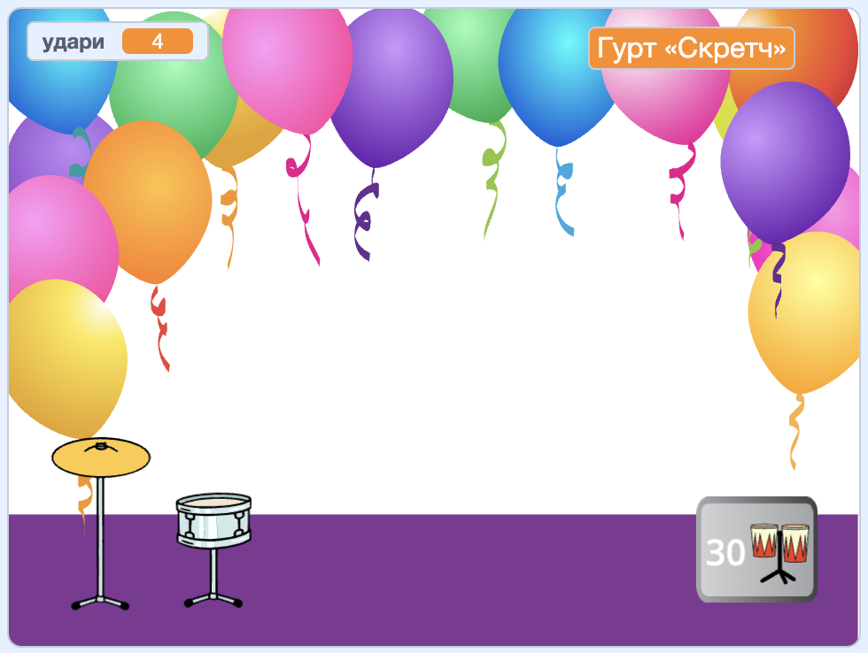
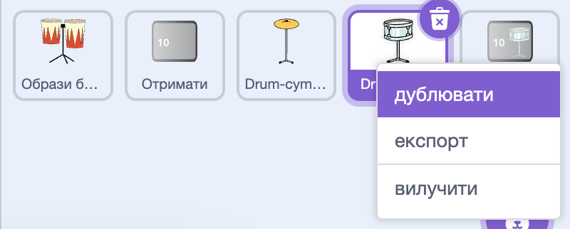
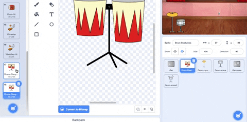
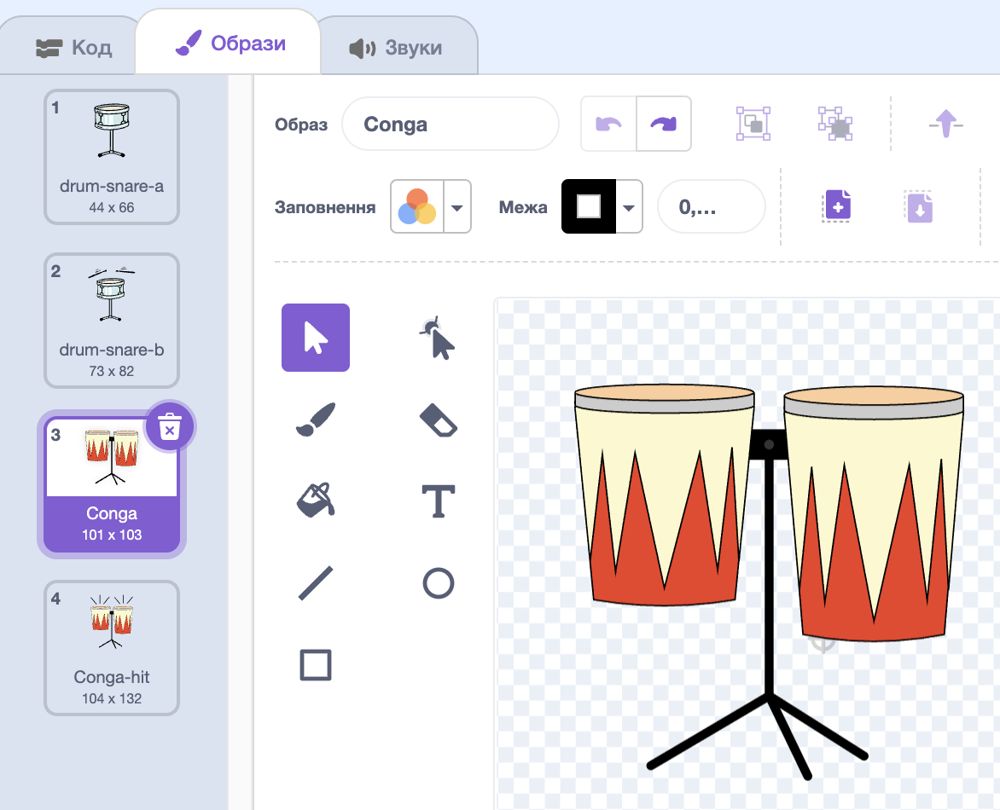
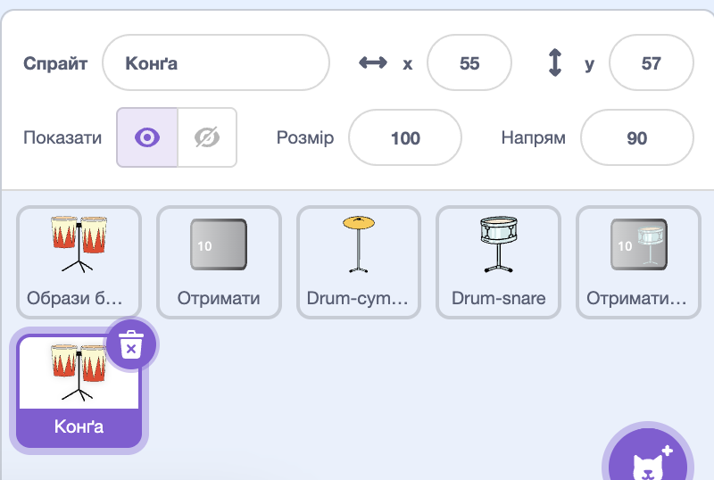
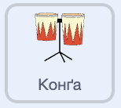
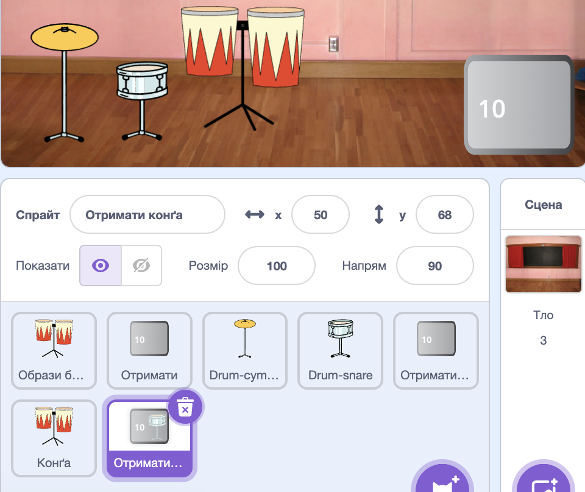
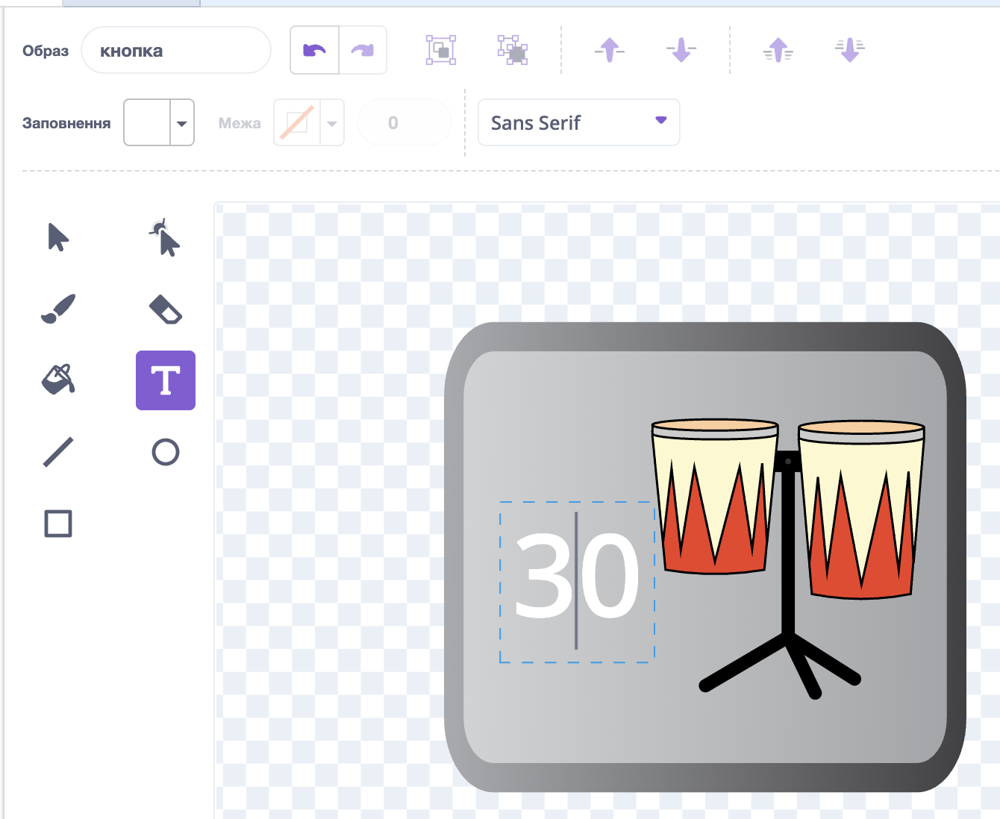
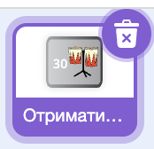
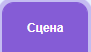

## Більше барабанів!

<div style="display: flex; flex-wrap: wrap">
<div style="flex-basis: 200px; flex-grow: 1; margin-right: 15px;">
На цьому кроці ти вибереш, який барабан додати.
</div>
<div>
{:width="300px"}
</div>
</div>

--- task ---

Скопіюй спрайт **Drum-snare**:



--- /task ---

--- task ---

Натисни на спрайт **Образи барабанів** і вибери вкладку **Образи**.

**Вибери**, який барабан гравець розблокує наступним. Ми вибрали **Конга**.


--- /task ---

--- task ---

Перетягни образи «під час удару» і «без удару» вибраного барабана до нового спрайту **Drum-snare2**:





--- /task ---

--- task ---

Назви свій барабан відповідно до вибраних образів.



--- /task ---

--- task ---

Натисни вкладку **Код**. Зміни образи в коді на нові та вибери звук для нового барабана.

Зміни кількість ударів, що заробляє новий барабан, на `5`:



```blocks3
when this sprite clicked
+change [удари v] by [5] // 5 ударів за клік
+switch costume to [ v] // образ під час удару
+play drum [ v] for [0.25] beats // звук барабана
+switch costume to [ v] // образ без удару
```

--- /task ---

--- task ---

Перетягни новий барабан у потрібне положення на Сцені:


--- /task ---

Додай кнопку, щоб гравці могли розблокувати новий барабан.

--- task ---

Здублюй спрайт **Отримати малий барабан** і розмісти його в правому нижньому куті Сцени.

--- /task ---

--- task ---

Зміни його назву (наприклад, `Отримати конґу`):



--- /task ---

--- task ---

Видали **малий барабан** з нового образу кнопки «Отримати».

--- /task ---

--- task ---

Скопіюй костюм «без удару» для нового барабана та встав його в новий образ кнопки «Отримати».

--- /task ---

--- task ---

Натисни інструмент **Текст** і зміни число на `30`. Це вартість нового барабана.



--- /task ---

Твоя нова кнопка «Отримати» має `сховатися`{:class="block3looks"} на початку.

--- task ---



```blocks3
when flag clicked
+ hide
```

--- /task ---

--- task ---

Додай скрипт `коли я отримую`{:class="block3events"}, щоб твоя нова кнопка «Отримати» `показувалась`{:class="block3looks"}, коли гравець розблокує малий барабан.

```blocks3
when I receive [малий барабан v] // зʼявляється, коли розблоковано попередній барабан
show // показати кнопку для отримання нового барабана
```

--- /task ---

--- task ---

Зміни:
- Кількість ударів, необхідних для розблокування цього барабана.
- Кількість ударів, які віднімаються від загальної кількості, коли гравець розблоковує цей барабан.
- Повідомлення в `оповіщенні`{:class="block3events"}, коли гравець отримує новий барабан.

```blocks3
when this sprite clicked
if <(удари)>  [29]> then // зміни на 29
hide
change [удари v] by [-30] // зміни на -30
broadcast (конґа v) // зміни на назву свого барабана
else
say [Потрібно більше ударів!] for [2] seconds 
end
```

--- /task ---

--- task ---

Клацни новий спрайт барабана та зміни скрипт `коли я отримую малий барабан`{:class="block3events"}, щоб він зʼявлявся, коли новий барабан розблоковано:

```blocks3
when I receive [конґа v] // зміни на назву свого барабана
show
```

--- /task ---

--- task ---

Додай тло **«Вечірка»** (Party).

--- /task ---

--- task ---

Додай до Сцени скрипт, який перемикатиме тло, коли гравець переходить на новий барабан:



```blocks3
when I receive [конґа v] // зміни на назву свого барабана
switch backdrop to (Party v)
```

--- /task ---

--- task ---

**Протестуй:** для початку гри натисни на зелений прапорець.

You should unlock your new drum if you earn enough beats.

Що станеться, якщо ти натиснеш кнопку до того, як заробиш достатньо ударів?

--- /task ---

--- save ---
