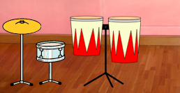

## Second upgrade

<div style="display: flex; flex-wrap: wrap">
<div style="flex-basis: 200px; flex-grow: 1; margin-right: 15px;">
Your drum skills are improving. Time for a second upgrade! In this step, you will choose which drum to add.
</div>
<div>
{:width="300px"}
</div>
</div>

--- task ---

Duplicate the **Drum-snare** sprite:


--- /task ---

The **Drum Costumes** sprite has lots of drum costumes for you to choose from.

--- task ---

Click on the **Drum Costumes** sprite and select the **Costumes** tab.

**Choose:** a drum for the next upgrade. We chose **Conga**.

Drag the 'hit' and 'not hit' costumes of your chosen drum to your new **Drum-snare2** sprite:


--- /task ---

--- task ---

Name your drum to match the costumes you chose.


--- /task ---

--- task ---

Click on the **Code** tab. Change the code to use the correct costumes and choose a sound for your new drum.

Change the number of beats you earn by clicking the new drum to `5`:


```blocks3
when this sprite clicked
+change [beats v] by [5] //5 beats per click
+switch costume to [ v] //your hit costume
+play drum [ v] for [0.25] beats //your drum sound
+switch costume to [ v] //your not hit costume
```

--- /task ---

--- task ---

Drag your new drum into position on the Stage:



--- /task ---

Next, you need a button so that players can upgrade to this new drum.

--- task ---

Duplicate the **Get snare** sprite.

Position it in the bottom-right corner of the Stage. Change its name to `Get` and then the name of your new drum:


--- /task ---

--- task ---

Delete the **snare drum** from the button costume. Copy and paste the 'not hit' costume for your new drum to the button costume.

Click on the **Text** tool and change the number to `30` to show the cost of the new drum.

Your button should look like this:


--- /task ---


This button should `hide`{:class="block3looks"} at the start, then `show`{:class="block3looks"} when the player upgrades to the snare drum, so they know which drum they are working towards.

--- task ---


```blocks3
when flag clicked
- show
+ hide
```

**Tip:** To delete a block, drag it to the Blocks menu, or right-click and choose **Delete Block**. On a computer, you can also click on a block and then tap <kbd>Delete</kbd> to remove a block.

--- /task ---

--- task ---

Add a `when I receive`{:class="block3events"} script that your new drum button will show as the next upgrade when the player gets the **Drum-snare** drum:


```blocks3
when I receive [snare v] // appear when previous drum is bought
show // show button for next available drum
```

--- /task ---

--- task ---

Change the number of beats needed to buy this drum, and the number of beats that are removed, when the player gets this drum.

Also change the message that is `broadcast`{:class="block3events"} when the player gets the new drum. Create a new message with the name of your new drum:


```blocks3
when this sprite clicked
if <(beats)>  [29]> then // change to 29
hide
change [beats v] by [-30] // change to 30
broadcast [conga v] // change to your drum name
else
say (join ((30) - (beats)) [beats needed!]) for [2] seconds
end
```

--- /task ---

--- task ---

Change the `when I receive snare`{:class="block3events"} script to `broadcast`{:class="block3events"} the name of your new drum. The drum will `show`{:class="block3looks"} when the player upgrades to the new drum:


```blocks3
when I receive [conga v] // change to your drum name
show
```

--- /task ---

--- task ---

Add the **Party** backdrop.

Add a script to the Stage to switch the backdrop when the player upgrades to the new drum:


```blocks3
when I receive [conga v] // change to your drum name
switch backdrop to (Party v)
```

--- /task ---

--- task ---

**Test:** Click the green flag to start the game and test that you can earn enough beats to get your new drum.

What happens if you click the button before you have earned enough beats?

--- /task ---

--- save ---
