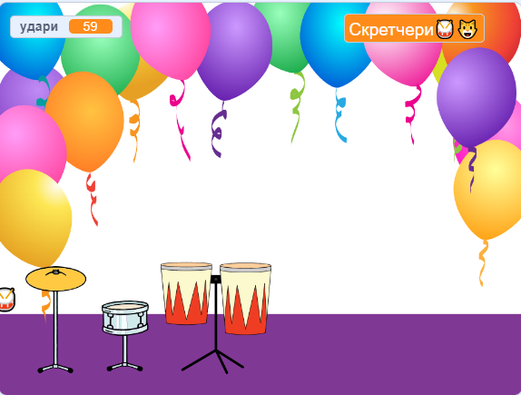

## Грай

Настав час випробувати свою гру.

{:width="300px"}

--- task ---

Якщо ти раніше відокремив/-ла блок `запитати`{:class="block3sensing"} на Сцені, перетягни його на місце.

**Протестуй:** натисни на зелений прапорець та вкажи своє рок-зіркове імʼя!

Імʼя на Сцені має змінитися.

--- /task ---

--- save ---
