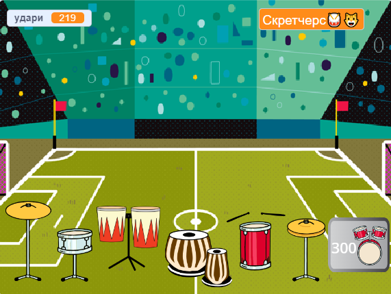

## Додаткове завдання

<div style="display: flex; flex-wrap: wrap">
<div style="flex-basis: 200px; flex-grow: 1; margin-right: 15px;">
Удоскональ свій проєкт, додавши більше барабанів і майданчиків. 
</div>
<div>
{:width="300px"}
</div>
</div>

### Додай інші барабани

Щоб додати ще один барабан, який можна розблокувати, візьми за зразок попередні кроки проєкту.

Якщо тобі потрібне нагадування, як це робити, читай далі.

--- collapse ---

---
title: For the drum
---

--- task ---

Здублюй попередній спрайт **барабана** і додай два образи.

--- /task ---

--- task ---

Зміни `образ`{:class="block3looks"} і `звук`{:class="block3sound"}, які будуть використовуватись у скрипті `коли спрайт натиснуто`{:class="block3events"}.

--- /task ---

--- task ---

Зміни кількість зароблених `ударів`{:class="block3variables"} у скрипті `коли спрайт натиснуто`{:class="block3events"}.

--- /task ---

--- task ---

Зміни `повідомлення`{:class="block3events"}, яке `показує`{:class="block3looks"} барабан, на повідомлення для **нового барабана**.

--- /task ---

--- /collapse ---

--- collapse ---

---
title: For the 'Get' button
---

--- task ---

Здублюй попередній спрайт **«Отримати»**.

--- /task ---

--- task ---

Зміни `повідомлення`{:class="block3events"}, через яке з’являється кнопка, на `повідомлення`{:class="block3events"} **попереднього барабана**.

--- /task ---

--- task ---

Зміни `образ`{:class="block3looks"} і вартість нового барабана.

--- /task ---

--- task ---

Зміни кількість `ударів`{:class="block3variables"} для отримання цього барабана в умові `якщо`{:class="block3events"}. Зміни від’ємну кількість `ударів`{:class="block3variables"} в блоці `змінити на`{:class="block3variables"}. Зміни число, від якого потрібно відняти значення змінної `удари`{:class="block3variables"} у блоці `зʼєднати`{:class="block3operators"}. Зміни повідомлення в `оповіщенні`{:class="block3events"} на назву **нового барабана**.

--- /task ---

--- /collapse ---

--- collapse ---

---
title: For the venue
---

--- task ---

Додай нове тло.

--- /task ---

--- task ---

Додай до Сцени скрипт `змінити тло на`{:class="block3looks"} нове тло, коли отримано `повідомлення`{:class="block3events "} для цього барабана.

--- /task ---

Може статися так, що на іншому тлі тобі потрібно буде по-новому розташувати свої барабани.

--- task ---

Додай до кожного спрайта **барабанів** скрипт, який починається з `коли тло змінюється на`{:class="block3events"}, а також блок `перейти до`{:class="block3motion"}, щоб вони змінили розташування.

Тобі також потрібно буде встановити їх початкову позицію `коли зелений прапорець натиснуто`{:class="block3events"}.

--- /task ---

--- /collapse ---

### Покращ зворотний зв'язок із гравцем

Повідом гравцю, **скільки** точно ударів йому потрібно, щоб розблокувати наступний барабан.

--- task ---

Додай цей код, щоб `зʼєднати`{:class="block3operators"} необхідну кількості ударів із текстом, за допомогою якого ти повідомляєш гравцеві, що йому потрібно більше ударів, якщо він ще не здобув достатньо для наступного барабана:

```blocks3
when this sprite clicked
if <(удари)>  [9]> then // якщо 10 чи більше ударів
hide
change [удари v] by [-10] // відняти вартість нового барабана
else
+ say (join ((10) - (удари)) [ударів потрібно!]) for [2] seconds
end
```

**Примітка**: зміни числа на ті, що потрібні для розблокування кожного барабана.

--- /task ---

### Упорядкуй свій код

--- task ---

**Наведи лад:** якщо у тебе є час, переконайся, що спрайти в списку спрайтів розташовані у зрозумілому порядку: спочатку барабани у порядку розблокування, а потім кнопки по черзі.

--- /task ---

--- task ---

### Щось не виходить?

**Налагодження:** спочатку переконайся, що ти чітко розумієш, коли мають показуватися барабани та кнопки та як має змінюватися змінна `удари`{:class="block3variables"}. Набагато легше налагодити проєкт, якщо ти чітко розумієш, що він має робити.

--- collapse ---
---
title: My drum doesn't show/hide correctly
---

Якщо це не перший барабан, то він має мати скрипт `коли зелений прапорець натиснуто`{:class="block3events"}, щоб `ховатися`{:class= "block3looks"}.

Він повинен мати скрипт `коли я отримую`{:class="block3events"} `цей барабан`, щоб `показатися`{:class="block3looks"}.

Переконайся, що кнопка **Отримати** для цього барабана `оповіщує`{:class="block3events"} за допомогою того ж самого повідомлення.

--- /collapse ---

--- collapse ---
---
title: My Get button doesn't show/hide correctly
---

Усі кнопки (крім кнопки для першого барабана) повинні `ховатися`{:class="block3looks"}, `коли зелений прапорець натиснуто`{:class=" block3events"}.

Вона має `показуватися`{:class="block3looks"}, `коли я отримую`{:class="block3events"} повідомлення для **попереднього барабана**.

Кнопка **«Отримати»** має `показуватися`{:class="block3looks"}, щоб гравець знав, який барабан він може розблокувати наступним.

--- /collapse ---

--- collapse ---
---
title: I can unlock a drum when I don't have enough beats
---

Переконайся, що ти змінив/-ла кількість `ударів`{:class="block3variables"}, необхідних, `коли цей спрайт натиснуто`{:class="block3events"}, у скрипті для кнопки **«Отримати»** цього барабана.

--- /collapse ---

--- collapse ---
---
title: The number of beats doesn't change correctly when I unlock a new drum
---

Переконайся, що ти `змінив/-ла удари на`{:class="block3variables"} від’ємне число, `коли цей спрайт натиснуто`{:class="block3events"}, у скрипті для кнопки **«Отримати»** цього барабана.

Переконайся, що це число збігається з числом на образі кнопки барабана.

--- /collapse ---

--- /task ---

**Порада:** якщо ти не можеш розібратися, можна видалити новий барабан з кнопкою і почати знову. Іноді помітити помилку буває важко.

--- save ---
