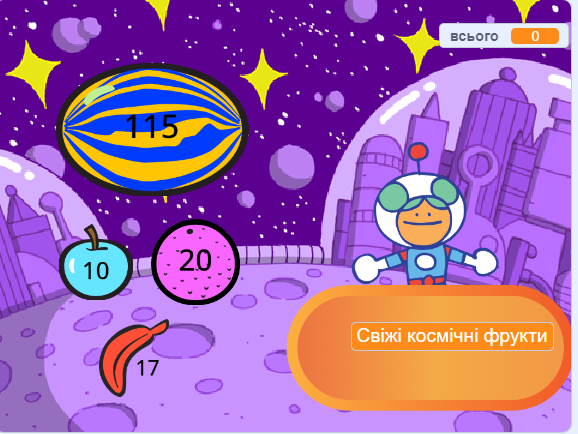

## Що ти тепер вмієш?

Якщо ти йдеш напрямом [Більше Скретчу](https://projects.raspberrypi.org/uk-UA/raspberrypi/more-scratch), можеш переходити до наступного проєкту — [«Наступний покупець!»](https://projects.raspberrypi.org/uk-UA/projects/next-customer-please). У ньому ти створиш магазин, де покупці можуть купувати товари.

--- print-only ---

--- /print-only ---

--- no-print ---

  <iframe allowtransparency="true" width="485" height="402" src="https://scratch.mit.edu/projects/embed/1107251106/?autostart=false" frameborder="0"></iframe>

--- /no-print ---

Якщо тобі подобається досліджувати Скретч, спробуй [ці проєкти](https://projects.raspberrypi.org/uk-UA/projects?software%5B%5D=scratch&curriculum%5B%5D=%201){:target="_blank"}.

***

Цей проєкт переклали волонтери:

Yevgenia Lazuk

Завдяки волонтерам ми надаємо можливість людям у всьому світі навчатися рідною мовою. Ви також можете допомогти нам у цьому — більше інформації про волонтерську програму на [rpf.io/translate](https://rpf.io/translate).
